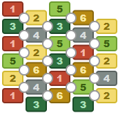
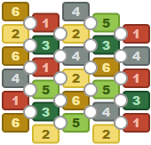

# ta_kan_board
Toy project to generate a board game for an unreleased project.

The game board is built with 6 different resource cards placed following these rules:
- There are spots that touch 3 cards each
- Each spot is unique in the resources it touches — no other spot has those same 3 resources

The number of combinations is `C(6, 3) = 20`, but how many ways of arranging them are there? The answer is `20! = 2_432_902_008_176_640_000`, so we needed some constraints.

Surprisingly, adding the constraint that resources of the same type should not touch each other reduced the solutions to 252, and they look like this:

We then removed repeated patterns. For example, this one is like the one above with the colors swapped:

When we removed the solutions with the same pattern, the answer to all our questions was...

**... 42**

# [> Run the demo here <](https://raranguren.github.io/ta_kan_board/)